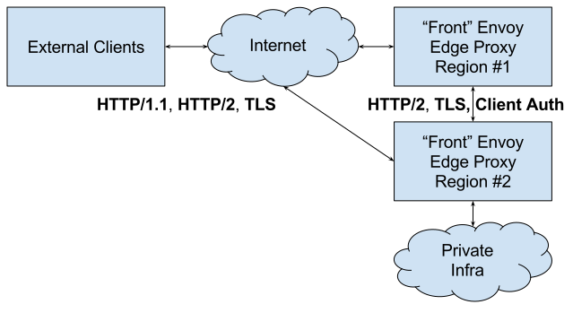

# 服务间、前端代理、双向代理

上图展示了 [前端代理](front_proxy.md#deployment-type-front-proxy) 与另一个 Envoy 集群组成的 *双向代理* 的配置。双向代理背后的想法是，尽可能接近用户地终止 TLS 和客户端连接（TLS 握手的更短往返时间，更快的 TCP CWND 扩展，更小几率的数据包丢失等）会更高效。 连接在双向代理中被终止，然后被复用到运行在主数据中心的 HTTP/2 长连接中。

在上图中，在区域1中运行的 Envoy 前端代理通过 TLS 相互身份验证和固定证书与在区域2中运行的 Envoy 前端代理进行身份验证。这使得在区域2中运行的 Envoy 前置实例能信任通常不可信的传入请求的元素（例如 x-forwarded-for HTTP 头）。

## 配置模板

源码包含一个与 Lyft 在生产环境中运行的版本非常相似的示例双向代理配置。有关更多信息，请参阅 [这里](../../install/ref_configs.md#install-ref-configs)。