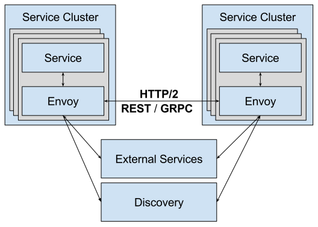

# 仅服务之间

上图显示了最简单的 Envoy 部署，它使用 Envoy 作为面向服务架构（SOA）内部的所有流量的通信总线。在这种情况下，Envoy 暴露了几个用于本地来源流量以及服务流量的监听器。

## 服务间 egress listener

这是应用程序与基础结构中的其他服务对话所使用的端口。 例如，*<http://localhost:9001>*。HTTP 和 gRPC请求使用 HTTP/1.1 *host* 头或 HTTP/2*:authority* 头来表示请求指向哪个远程集群。根据配置中的详细信息，Envoy 处理服务发现、负载平衡、速率限制等。服务只需要了解本地 Envoy，不需要关心网络拓扑结构，无论他们是在开发还是在生产中运行。

此监听器支持 HTTP/1.1 或 HTTP/2，具体取决于应用程序的功能。

## 服务间 ingress listener

这是远程 Envoys 想要与本地 Envoys 通信时使用的端口。例如，*<http://localhost:9211>*。入向请求将通过配置的端口路由到本地服务。根据应用程序或负载平衡需求（例如，如果服务需要 HTTP 端口和 gRPC 端口），可能会涉及多个应用程序端口。 本地 Envoy 根据需要执行缓冲、熔断等。

我们的默认配置对所有 Envoy 相互间的通信使用 HTTP/2 协议，无论应用程序在通过本地 Envoy 出向时使用的是 HTTP/1.1 还是 HTTP/2。 HTTP/2 通过长连接和显式重置通知提供更好的性能。

## 可选外部服务 egress listener

通常，本地服务要通信的每个外部服务都要使用显式定义的出口端口。这是因为一些外部服务 SDK 不会轻易支持覆盖 *host* 头以允许标准的 HTTP 反向代理行为。例如，*<http://localhost:9250>* 可以被分配作为 DynamoDB 的连接地址。我们建议为所有外部服务使用本地端口路由，而不是为一些外部服务使用 *host* 路由，另一些使用专用本地端口路由。

## 发现服务集成

建议的服务之间的配置对所有集群查找使用外部发现服务。 这为 Envoy 在执行负载平衡，统计收集等时提供了可能的最详细信息。

## 配置模板

源代码发行版包含一个服务配置示例服务，与 Lyft 在生产环境中运行的版本非常相似。 有关更多信息，请参阅[这里](../../install/ref_configs.html#install-ref-configs)。